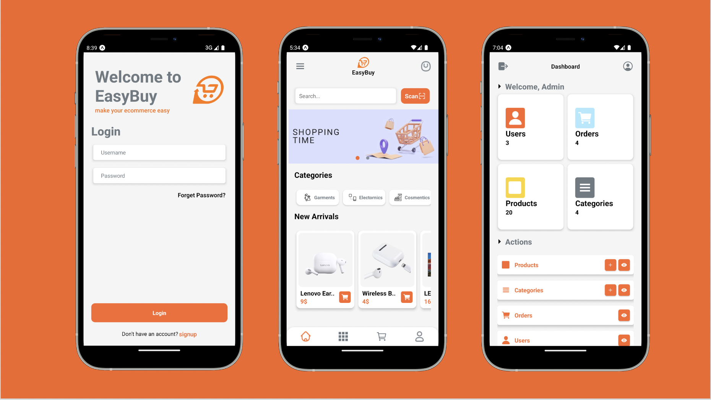

# React-Native Stock Manager App

# Hi, We are the Digitan Solutions! 👋

[]

## `Development Stack` ➡️ `MERN Stack`

### `Backend on NodeJs`

Open-Source React Native Stock Manager Cross Platform Mobile App :iphone:

## Mockups



.


## Features :memo:

- [x] Stack Naviagtion
- [x] Splash Screen
- [x] Login Screen
- [x] Signup Screen
- [x] Forget Screen
- [x] User Profile Screen
- [x] My Account Screen
- [x] Update Password Screen
- [x] Admin Login
- [x] Admin Dashboard
- [x] Admin Add Product
- [x] Admin View Product
- [x] Admin Edit Product
- [x] Cart Screen
- [x] Checkout Screen

## How to Run App :white_check_mark:

### `Clone the repo`

To clone this repo, type the following command

```
git clone https://github.com/egbodofo/Afso-Stock-Manager.git
```

### `Node Package Manager`

To install all the dependencies, use node package manager and run the command

```
npm i
```

### `npm start`

Runs your app in development mode.

Open it in the [Expo app](https://expo.io) on your phone to view it. It will reload if you save edits to your files, and you will see build errors and logs in the terminal.

Sometimes you may need to reset or clear the React Native packager's cache. To do so, you can pass the `--reset-cache` flag to the start script:

```
npm start -- --reset-cache
# or
yarn start -- --reset-cache
```
